# 🤖 Production RAG + Human-in-the-Loop Agent

> A stateful, auditable RAG agent for **industrial / technical document intelligence** — retrieves over your documents, drafts a grounded answer, then **pauses for a human to approve, edit, or reject** before anything is committed. Every query is logged with token cost, latency, and a full audit trail.

[](https://github.com/ejazfahil/Production_RAG_HumanLoop_Agent/actions/workflows/ci.yml)
[](https://python.org)
[](https://langchain-ai.github.io/langgraph/)
[](https://fastapi.tiangolo.com/)
[](https://github.com/pgvector/pgvector)
[](https://prometheus.io/)
[](LICENSE)

---

## 🎯 Overview

In regulated and safety-adjacent settings — utility-meter datasheets, equipment specs, maintenance manuals — a RAG system that *silently* answers is a liability. This project treats the LLM as a **drafting assistant whose output a human must sign off on**, and bakes the production discipline (abstention, grounding checks, durable state, cost/latency accounting, observability) directly into the agent graph.

The core ideas:

- **Retrieve → draft → ground-check → human approval → finalize**, expressed as an explicit [LangGraph](https://langchain-ai.github.io/langgraph/) state machine.
- **The agent abstains** rather than guessing when retrieval is weak or the draft isn't grounded in the retrieved context.
- **A durable interrupt** pauses the run at the approval gate; state is checkpointed so the run resumes later — even after a process restart.
- **Provider-agnostic LLM layer** — runs fully offline with a built-in `fake` provider (no API key) or any OpenAI-compatible endpoint (OpenAI, Mistral, **self-hosted vLLM, or a local Ollama server**).
- **Every query is accounted for**: tokens, estimated USD cost, per-node and end-to-end latency, retrieved sources, the human decision, and the final answer — all persisted and exported to Prometheus/Grafana.

## 🏗️ Architecture — the agent loop & the human gate

The agent is a compiled LangGraph `StateGraph` (`src/prag/agent/graph.py`) over a typed `AgentState`. Each node is small, instrumented, and side-effect-aware (`src/prag/agent/nodes.py`):

```mermaid
flowchart TD
    START([query]) --> R[retrieve<br/>pgvector / in-memory cosine]
    R -->|top_score &ge; min_retrieval_score| D[draft_answer<br/>LLM, strict-context prompt]
    R -->|weak retrieval| AB[abstain]
    D --> G[grounding_check<br/>content-word support &ge; 0.6]
    G -->|grounded| H{{HITL approval gate<br/>interrupt&#40;&#41; — run pauses}}
    G -->|not grounded| AB
    H -->|approve / edit| F[finalize]
    H -->|reject| F
    F --> E([answered / rejected])
    AB --> E2([abstained])

    F -.token cost · latency · decision.-> AUD[(Audit trail<br/>Postgres / in-memory)]
    H -.approve|edit|reject counters.-> PM[[Prometheus /metrics]]
    D -.tokens · USD · node latency.-> PM
    PM --> GR[[Grafana dashboard]]
```



**How the human-in-the-loop gate works.** When a draft passes the grounding check, the `hitl_approval` node calls LangGraph's `interrupt(...)`, handing the reviewer the query, the draft, the cited sources, and a confidence score, then **suspends the run**. Because the graph is compiled with a **checkpointer** (memory / SQLite / Postgres), the paused state is durable. A reviewer later resumes via `Command(resume={"action": "approve|edit|reject", "text": ...})`:

- `approve` → the draft becomes the final answer.
- `edit` → the human-supplied text replaces the draft.
- `reject` → no answer is released; the query is recorded as `rejected`.

For CI / smoke runs, `AUTO_APPROVE=true` bypasses the interrupt (and is explicitly *not* for production).

**Cost & latency logging.** The `draft_answer` node records input/output tokens and an estimated USD cost (derived from a per-model `PRICING` table in `src/prag/llm/base.py`) onto both the agent state and Prometheus counters. The `Engine` (`src/prag/engine.py`) times each query end-to-end (excluding human wait time), and the **audit repository** (`src/prag/audit/repository.py`) persists a full `AuditRecord` per `thread_id`: retrieved doc ids, top score, draft, decision, final answer, tokens, cost, latency, and timestamps.

## 🧩 Tech Stack & Tools

| Area | Libraries (from `pyproject.toml`) |
|------|-----------------------------------|
| Agent / state machine | `langgraph`, `langgraph-checkpoint-sqlite`, `langgraph-checkpoint-postgres`, `langchain-core` |
| API | `fastapi`, `uvicorn[standard]`, `pydantic`, `pydantic-settings` |
| Retrieval / storage | `psycopg[binary]`, `pgvector` (Postgres backend) + an in-memory cosine store |
| Documents | `pypdf` (PDF), native Markdown / text ingestion; `tiktoken` |
| Observability | `prometheus-client`, `structlog`, `opentelemetry-{api,sdk,instrumentation-fastapi}` |
| LLM transport | `httpx` (OpenAI-compatible client) |
| Tooling | `ruff`, `mypy` (strict, `disallow_untyped_defs`), `pytest`, `pytest-asyncio`, `pytest-cov`, `pre-commit` |

## 📁 Project Structure

```
Production_RAG_HumanLoop_Agent/
├── src/prag/
│   ├── engine.py              # Wiring point: ingest / query / resume; owns the graph + audit
│   ├── config.py              # Typed settings via pydantic-settings (.env)
│   ├── agent/
│   │   ├── graph.py           # StateGraph assembly + checkpointer (memory/sqlite/postgres)
│   │   ├── nodes.py           # retrieve · draft · grounding_check · hitl_approval · finalize · abstain
│   │   └── state.py           # AgentState / RetrievedRef typed dicts
│   ├── retrieval/
│   │   ├── store.py           # InMemoryVectorStore + PgVectorStore (cosine; lazy schema)
│   │   └── chunking.py        # Token-aware chunking
│   ├── ingestion/pipeline.py  # Read (md/txt/pdf) → chunk → index
│   ├── llm/
│   │   ├── base.py            # LLM/Embedder protocols, Usage + PRICING cost model
│   │   ├── factory.py         # fake | OpenAI-compatible (OpenAI/Mistral/vLLM/Ollama)
│   │   └── fake.py            # Fully-offline deterministic LLM + embedder
│   ├── audit/repository.py    # AuditRecord + in-memory / Postgres (JSONB) repositories
│   ├── observability/
│   │   ├── metrics.py         # Prometheus counters & histograms
│   │   └── logging.py         # structlog setup
│   └── api/                   # FastAPI app, routes (/query, /approvals/{id}, /ingest, /metrics), schemas
├── scripts/ingest_samples.py  # CLI ingestion of data/sample
├── data/sample/               # Example industrial docs (meter spec, maintenance manual)
├── observability/grafana/     # Provisioned dashboard
├── docs/                      # architecture.md + ADRs (LangGraph, pgvector, provider-agnostic LLM)
├── tests/                     # HITL, grounding, retrieval, chunking, tracker tests
├── docker-compose.yml         # postgres (pgvector) + app + pgadmin
├── Dockerfile · Makefile · langgraph.json · pyproject.toml · uv.lock
```

## ✨ Key Features

- **Explicit, typed agent graph** — six nodes with conditional routing; the control flow (abstain vs. answer vs. escalate-to-human) is readable, not buried in prompt glue.
- **Durable human-in-the-loop** — `interrupt()` + a pluggable checkpointer (memory / SQLite / Postgres) so approvals survive restarts; resume with approve / edit / reject.
- **Abstention by design** — two guardrails: a `min_retrieval_score` floor after retrieval and a transparent groundedness check (fraction of the draft's content words supported by the retrieved context, threshold `0.6`) before the answer can reach a human.
- **pgvector + in-memory parity** — both stores satisfy one `add`/`search` contract; pgvector uses cosine distance (`<=>`) and lazily creates the extension/table on first use.
- **Cost, token & latency accounting** — per call and per query, emitted as Prometheus counters/histograms and saved to the audit trail.
- **Provider-agnostic, GDPR-friendly** — swap OpenAI → Mistral (EU) → a self-hosted vLLM / local Ollama endpoint with **env vars only**; the `fake` provider needs no network at all.
- **Full audit trail** — every query's lifecycle persisted (JSONB in Postgres) for accountability.
- **Production hygiene** — strict `mypy`, `ruff`, pytest suite (HITL / grounding / retrieval / chunking / tracker), CI, Docker Compose, and ADRs documenting the key design decisions.

## 🔌 Run fully offline with a local LLM (Ollama)

The generation provider is OpenAI-compatible and swappable via env vars, so the agent runs with **no external API, no API key, and zero per-token cost** — every request stays on the machine (useful for on-prem / GDPR-sensitive document data). Point it at a host [Ollama](https://ollama.com) server (this is the default wiring in `docker-compose.yml`):

```yaml
# docker-compose.yml (app service)
LLM_PROVIDER: openai
LLM_MODEL:   qwen3:8b                                # or llama3.2:3b for lower latency
LLM_API_KEY: ollama                                  # placeholder; Ollama ignores it
LLM_BASE_URL: http://host.docker.internal:11434/v1
EMBEDDING_PROVIDER: fake                             # only the offline embedder is wired in this repo
VECTOR_BACKEND: pgvector
CHECKPOINTER:   postgres
```

> **Note on the embedder.** Only the `fake` (deterministic, offline) embedder is implemented in this repo; real embedding providers slot in behind the same `Embedder` protocol in `src/prag/llm/factory.py`. Retrieval quality therefore depends on wiring a real embedder for production use.

## 🚀 Getting Started

### Local (offline, no API key — uses the `fake` provider)

```bash
make setup                                   # pip install -e ".[dev]"
make ingest                                  # index data/sample into the in-memory store
make run                                     # uvicorn prag.api.app:app --reload --port 8000
make test                                    # pytest (HITL, grounding, retrieval, chunking, tracker)
```

### Query → approve flow (HTTP)

```bash
# 1) Ask a question (may return status="pending_approval" with a draft + sources)
curl -s localhost:8000/query \
  -H 'content-type: application/json' \
  -d '{"query":"What is the reference voltage of the ACME X200 meter?"}'

# 2) Inspect the pending draft for the returned thread_id
curl -s localhost:8000/approvals/<thread_id>

# 3) Human decision: approve | edit | reject
curl -s localhost:8000/approvals/<thread_id> \
  -H 'content-type: application/json' \
  -d '{"action":"approve"}'
```

Metrics are exposed at `GET /metrics` and health at `GET /health`.

### Docker (Postgres + pgvector, optionally a local LLM)

```bash
docker-compose up -d        # postgres (pgvector) + app (:8000) + pgadmin (:5050)
```

This brings up the pgvector-backed store and a Postgres checkpointer/audit, with the app pre-wired to a host Ollama endpoint (see above). Verified end-to-end against `qwen3:8b` from inside the container.

## 📊 Observability & cost model

- **Metrics** (`src/prag/observability/metrics.py`): `prag_node_latency_seconds`, `prag_query_latency_seconds` (excludes human wait time), `prag_tokens_total{model,direction}`, `prag_cost_usd_total{model}`, `prag_queries_total{outcome}`, `prag_approvals_total{decision}`, `prag_ingested_chunks_total`, `prag_errors_total`.
- **Cost estimation**: `Usage.cost_usd` derives spend from a per-1K-token `PRICING` table in `src/prag/llm/base.py`. The shipped rates are **illustrative defaults**; confirm them against current provider pricing before relying on dollar figures. (The `fake`/local-Ollama path is genuinely $0.)
- **Dashboard**: a provisioned Grafana dashboard lives in `observability/grafana/`.

> No benchmark accuracy/latency numbers are reported here because none were measured on a fixed evaluation set in this repo — the value is the *methodology and instrumentation*, not asserted scores.

## 🧪 Configuration (selected)

Loaded from `.env` via `pydantic-settings` (`src/prag/config.py`):

| Variable | Meaning | Default |
|----------|---------|---------|
| `LLM_PROVIDER` / `LLM_MODEL` | `fake` \| `openai` \| `mistral` (+ `anthropic` planned) | `fake` / `fake-small` |
| `LLM_API_KEY` / `LLM_BASE_URL` | Credentials / endpoint for OpenAI-compatible providers | unset |
| `VECTOR_BACKEND` | `memory` \| `pgvector` | `memory` |
| `CHECKPOINTER` | `memory` \| `sqlite` \| `postgres` | `memory` |
| `TOP_K` | Documents retrieved per query | `4` |
| `MIN_RETRIEVAL_SCORE` | Abstain below this top score | `0.25` |
| `CHUNK_SIZE` / `CHUNK_OVERLAP` | Ingestion chunking | `800` / `120` |
| `AUTO_APPROVE` | Skip the human gate (CI/smoke only) | `false` |
| `DATABASE_URL` | Postgres DSN (pgvector + checkpointer + audit) | local default |

## 🧱 Challenges

- **Making human-in-the-loop *durable*, not just "pause in memory."** Solved with LangGraph's `interrupt()` plus a checkpointer abstraction so a paused approval survives a restart and resumes from the exact node.
- **Knowing when to *not* answer.** Two cheap, transparent guardrails (retrieval-score floor + content-word groundedness) keep the agent from confidently hallucinating over weak context — important for spec-sheet data.
- **Avoiding vendor lock-in.** A thin LLM/Embedder protocol keeps every vendor SDK out of the agent code, so OpenAI ↔ Mistral ↔ vLLM ↔ Ollama is a config change.

## 🔭 Future Work

- Wire a **real embedding provider** (currently only the offline `fake` embedder is implemented) and add HNSW indexing on the pgvector table.
- Swap the heuristic groundedness check for an **LLM-as-judge** (faithfulness / relevance).
- **Reviewer UI** and Slack/Teams notifications for the approval queue; SLA timeouts that auto-reject stale drafts.
- Multi-document cross-referencing and streaming responses with partial HITL.
- Calibrate the `PRICING` table against live provider rates and add per-tenant budgets.

## ✅ Conclusion

This repository is a compact but honest blueprint for **putting a human in the loop of a RAG system the production way**: an explicit, typed agent graph; durable approval interrupts; abstention guardrails; provider-agnostic, offline-capable inference; and first-class cost / latency / audit instrumentation. It optimizes for *trustworthiness and operability* over benchmark bragging — the discipline you actually need before a document-intelligence agent touches real industrial data.

## 📄 License

MIT — see [LICENSE](LICENSE).
